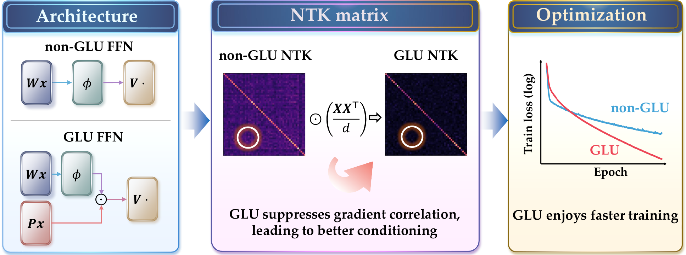

# The Devil is in the Condition Numbers: Why is GLU Better than non-GLU Structure?

Xingyu Lyu, Qianqian Xu, Zhiyong Yang, Peisong Wen, Qingming Huang

---

This is the official implementation of the paper "The Devil is in the Condition Numbers: Why is GLU Better than non-GLU Structure?" (Accepted by ICML 2026).

## Abstract



Gated Linear Units (GLU) and their variants are widely adopted in modern open-source large language model architectures and consistently outperform their non-gated counterparts, yet the underlying reasons for this advantage remain unclear. In this work, we study GLU by analyzing two-layer networks in the neural tangent kernel (NTK) regime. Our analysis reveals that the GLU structure reshapes the NTK spectrum, leading to a smaller condition number and a more compact eigenvalue distribution. Building on this finding, we further analyze the resulting training dynamics and show how the reshaped spectrum leads to faster convergence of GLU models, including a characteristic loss-crossing phenomenon observed between GLU and non-GLU models. Finally, we empirically observe that GLU has limited impact in reducing the generalization gap on various models, including ViT and GPT-2, suggesting that its primary benefit lies in accelerating optimization rather than reducing the generalization gap.

## Requirements

```bash
python -m venv .venv
source .venv/bin/activate
pip install -e .
```

Main dependencies are listed in `requirements.txt`.

## Datasets

- `MNIST` and `CIFAR10` are downloaded automatically via `torchvision`.
- `Tiny-ImageNet` is expected at:
  - `data/tiny-imagenet-200/train`
  - `data/tiny-imagenet-200/val`

## Training

Sample command for gap experiments on MLP-Mixer, CIFAR10, AdamW, ReGLU vs ReLU:

```bash
python scripts/train/train_activation_gap.py \
  --model mixer \
  --dataset cifar10 \
  --optimizer adamw \
  --activations reglu relu \
  --steps 100 \
  --lr 0.001 \
  --gpu 0
```

Sample command for MLP activation experiments on Gaussian data:

```bash
python scripts/train/train_activation_mlp.py \
  --dataset gauss \
  --steps 300 \
  --hidden_dim 1000 \
  --lr 0.008 \
  --activations reglu relu \
  --gpu 0
```

Additional commonly used commands:

```bash
python scripts/train/train_activation_gap.py \
  --model mixer \
  --dataset cifar10 \
  --optimizer adamw \
  --activations gelu geglu \
  --steps 100 \
  --lr 0.001 \
  --gpu 0

python scripts/train/train_activation_gap.py \
  --model mixer \
  --dataset cifar10 \
  --optimizer adamw \
  --activations silu swiglu \
  --steps 100 \
  --lr 0.001 \
  --gpu 0

python scripts/train/train_activation_mlp.py \
  --dataset mnist \
  --steps 150 \
  --hidden_dim 3136 \
  --lr 1e-5 \
  --activations reglu relu \
  --gpu 0

python scripts/train/train_activation_mlp.py \
  --dataset cifar10 \
  --steps 150 \
  --hidden_dim 5120 \
  --lr 3e-4 \
  --batch_size 128 \
  --activations reglu relu \
  --gpu 0
```

## NTK Scripts

The original exploratory NTK scripts are:

```bash
python scripts/ntk/ntk_eigen_mlp.py
python scripts/ntk/ntk_eigen_mixer.py
python scripts/ntk/ntk_eigen_vit.py
```

## Python Scripts

- `scripts/train/train_activation_gap.py`: trains Mixer or ViT classification models and saves train/test loss curves for activation-gap comparison.
- `scripts/train/train_activation_mlp.py`: trains MLP models on regression-style Gaussian, MNIST, or CIFAR10 targets and reports initial empirical NTK condition numbers.
- `scripts/plot/plot_condition_number_from_csv.py`: plots condition-number curves from `condition_number.csv`.
- `scripts/plot/plot_condition_number_bar+scatter.py`: plots Mixer activation condition numbers from `ntk_condition_numbers_mixer.csv`.
- `scripts/plot/plot_gap_scatter_augmented.py`: visualizes train-versus-gap scatter from augmented gap experiment logs.
- `scripts/plot/plot_loss_mlp_gauss.py`: compares Gaussian MLP loss curves for the baseline learning-rate setting.
- `scripts/plot/plot_loss_mlp_mnist.py`: compares MNIST MLP loss curves across activations.
- `scripts/plot/plot_ntk_heatmap.py`: renders teaser NTK heatmaps for MLP activation comparison.
- `scripts/plot/plot_training_dynamics.py`: visualizes MLP training trajectories together with local NTK ellipses.
- `scripts/ntk/ntk_eigen_mlp.py`: original MLP NTK eigenvalue and condition-number exploration script.
- `scripts/ntk/ntk_eigen_mixer.py`: original Mixer NTK eigenvalue and condition-number exploration script.
- `scripts/ntk/ntk_eigen_vit.py`: original ViT NTK eigenvalue and condition-number exploration script.
- `src/ntk/data.py`: shared dataset loaders for Gaussian, MNIST, CIFAR10, and Tiny-ImageNet experiments.
- `src/ntk/utils.py`: shared empirical NTK utility functions.
- `src/ntk/models/mlp.py`: MLP baseline and zero-output wrapper.
- `src/ntk/models/mlp_mixer.py`: MLP-Mixer model.
- `src/ntk/models/vit.py`: ViT model.

## Repository Structure

```text
.
├── src/ntk/        # reusable package code
├── scripts/train/  # main training entrypoints
├── scripts/plot/   # plotting and analysis scripts
└── scripts/ntk/    # original NTK exploratory scripts
```

## Notes

- This repo uses editable install so scripts can import `ntk.*`.
- Generated outputs such as plots, CSVs, logs, and local galleries are ignored by `.gitignore`.
- `generated_plots/` is local-only and not intended for Git upload.

## Citation

If you find this code useful, please cite:

```bibtex
@inproceedings{lyu2026glucondition,
  title={The Devil is in the Condition Numbers: Why is GLU Better than non-GLU Structure?},
  author={Lyu, Xingyu and Xu, Qianqian and Yang, Zhiyong and Wen, Peisong and Huang, Qingming},
  booktitle={International Conference on Machine Learning},
  year={2026}
}
```
